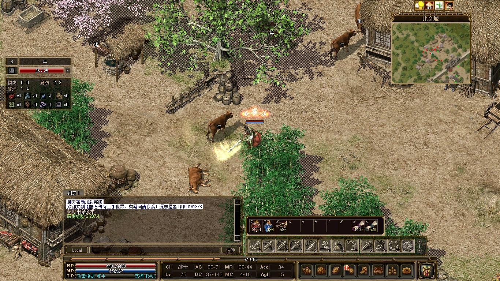
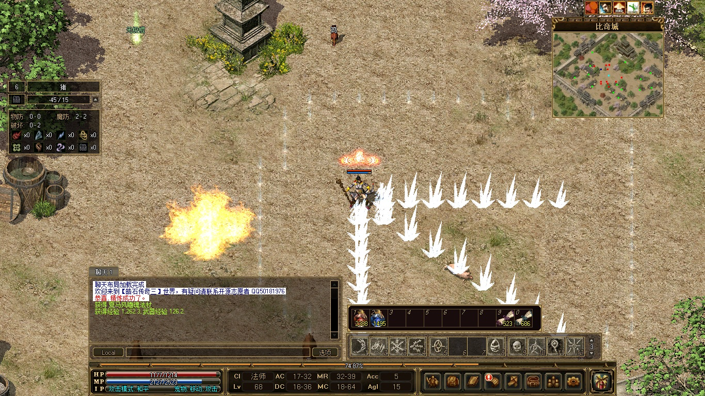
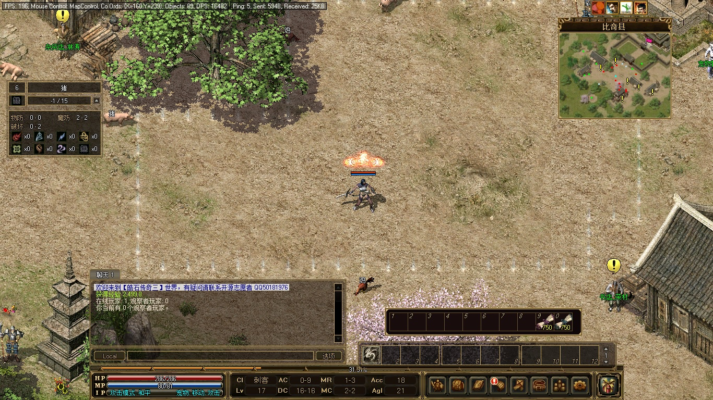
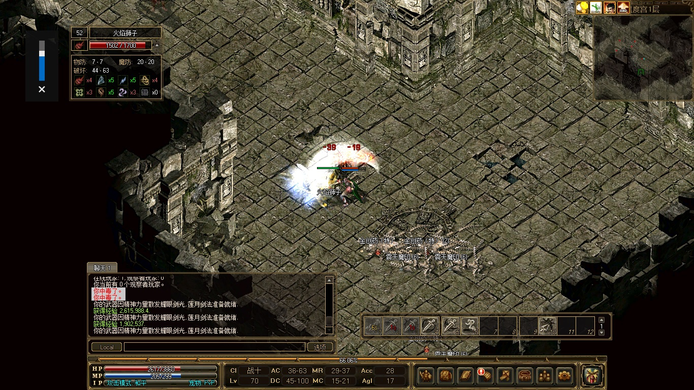

# 皓石传奇三- 服务器 Zircon Mir3 Server

本开源项目仅供学习游戏技术，禁止商用以及非法用途。

## 项目背景
本项目从吉米 2019 年流传出来的 Zircon 版本发展而来，
为降低部署成本，将服务器做成了跨平台可docker的版本，
由于原版服务器依赖商业组件 **DevExpress** 并且不支持跨平台，
因此连同界面一同剥离出去，仅数据库保持与原版工具兼容可编辑。

**注意：LOMCN上 2025 年发布的新版工具由于重构了数据库，无法兼容，只能和老版本工具兼容**

## 游戏简介

### 完整的传奇三游戏

- 含了四个职业：战士、法师、道士、刺客 
 
 
 
	
- 技能丰富，平均每个职业有 38 个技能 
 

- 地图和道具及其丰富，玩到 100级没压力；

- 技能正常修炼到 3级以后，还可通过打出高等级技能书一直升到 6级；

- 武器和首饰均可精炼，品质高的装备精炼上限也更高；

- 法师招宠与道士的宠物最高可升至暗金等级，各项属性翻倍，非常实用；

- 刺杀剑术破防之余，技能等级越高，刺杀剑术的攻速越快，爽之又爽；

## 客户端

【[客户端]( http://opanlist.cokei521.top/@s/cC1HxTzF)】 密码：159159

【[客户端依赖文件]( http://opanlist.cokei521.top/@s/SrU21yCh)】 密码：159159

	
### 便捷传送

每个传送石都可以方便地传送到任意地图。 

 

